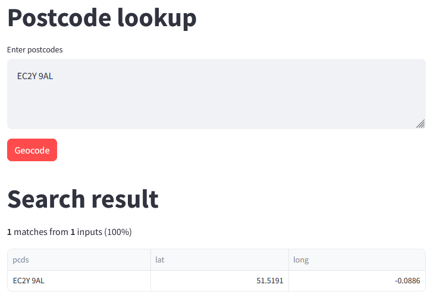

# Streamlit UK Postcode Lookups

Streamlit app to geocode UK postcodes. 

## Usage

Enter postcodes (one per line) and click "geocode" to return latitude and longitude for matched postcodes. 

## Screenshot

## Data source

Office for National Statistics licensed under the [Open Government Licence v.3.0](https://www.nationalarchives.gov.uk/doc/open-government-licence/version/3/)

